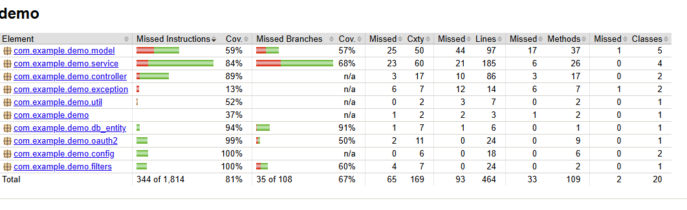

# Autonomous Probe Navigation REST API: Spring POC with OpenAPI + OAuth2 Security + PostgreSQL database

## Overview

Our team uses a remotely controlled submersible probe to explore the bottom of the sea. This project provides a REST API that accepts interpreted commands from the surface to navigate the probe across a grid-based map of the ocean floor. It ensures the probe stays within bounds, avoids obstacles, and logs each coordinate visited.

## Features

- **Grid Navigation:** Control the probe on a defined x/y grid.
- **Directional Movement:** Commands to move forward, backward, and turn left/right.
- **Boundary & Obstacle Handling:** Prevents the probe from leaving the grid and colliding with obstacles.
- **Activity Logging:** Maintains a summary of all visited coordinates.
- **RESTful API:** Simple endpoints for command input and status retrieval.

Check `src/main/resources/openapi.yaml` for REST API specification

### Autopilot feature 
`/v1/probe/{probeId}/autopilot` implements BFS algorithm to find path from current probe position to any destination on the grid.
This allows probe to avoid obstacles.
Furthermore, if new obstacle appears on the grid (e.g. 2nd probe detected by sensors) probe is 
retrying multiple times to update the grid to check if new obstacle has disappeared.

You can find the test for this feature (runnable from IntelliJ IDEA on one click with Cucumber plugins):
`src/test/resources/features/probe_autopilot.feature`

## Requirements

- A grid representing the ocean floor with defined x/y coordinates.
- An initial starting point (x, y) and an initial direction for the probe.
- A set of commands to control the probe:
    - Move forwards and backwards.
    - Turn left and right.
    - Maintain grid boundaries.
    - Avoid obstacles.
- Output the final position, direction, and a summary of all visited coordinates.


## Tools and Libraries

The `spring-poc` project is built with the following tools and libraries:

- **Spring MVC**: Enables the creation of RESTful APIs to expose application functionalities with robust routing and
  request handling.
- **Spring Data JPA**: Simplifies database interactions through repositories, offering CRUD operations and advanced
  query capabilities.
- **Lombok**: Minimizes boilerplate code by generating essential methods like getters, setters, builders, etc.
- **Liquibase**: Manages database schema migrations with version control, ensuring consistent database structure and
  easy updates.
- **OAuth2 Authentication**: Protects API endpoints using secure, token-based OAuth2 authentication.
- **Exception Handling with Controller Advice**: Centralized handling for application exceptions, ensuring consistent
  logging and error responses.
- **OpenAPI Specification**: Includes an `openapi.yaml` file to describe the REST API, enabling code generation and
  documentation.
- **Google Java Code Style**: Enforces a standardized code style, ensuring clean and maintainable code throughout the
  project.
- **Cucumber Testing**: Integrates Behavior-Driven Development (BDD) using human-readable scenarios in `.feature` files
  to ensure application functionality correctness.
- **Mockito for Unit Testing**: Used for mocking dependencies in unit tests and verifying expected behaviors.
- **Docker Compose Configuration**: Simplifies setup and testing of dependent services (e.g., PostgreSQL database) through a
  `docker-compose.yml` file, providing a consistent environment for local development and integration testing.
- **GitHub Pipeline for CI/CD**: Automates builds, testing, and code quality checks through a GitHub Actions workflow,
  ensuring code reliability and maintainability.
- **Jacoco**: Provides detailed code coverage reports during testing to ensure the implemented functionality is 
- well-tested and aligned with project requirements.

---

## Local Development

### First run

To ensure the correct version of Maven is used, run the following command:

```bash
./mvnw clean install
```

This will install the correct version of Maven if it is missing.

After the install command, you can check your Maven version with:

```bash
./mvnw -version
```

To update the Maven version, modify the `distributionUrl` in the `.mvn/wrapper/maven-wrapper.properties` file.

---

## Code Style

Before pushing your branch, make sure to apply the correct code formatting. Run the IntelliJ run configuration:
`Format Java Code Google Style`.

Additionally, every Maven build applies the code style defined in the `pom.xml` via the Spotless plugin. This ensures a
consistent code style across the project.

---

## IntelliJ Plugins

### Cucumber Plugins

#### Gherkin

This plugin is required for syntax highlighting of Cucumber tests in `.feature` files located under `/test/resources`.  
It also enables navigation from `.feature` files to Java code by holding `Ctrl` and left-clicking on the `Given`,
`When`, and `Then` keywords.

#### Cucumber for Java

This plugin is needed to run Cucumber tests directly from `.feature` files within IntelliJ.

---

### How to Contribute

1. Clone the repository:
   ```bash
   git clone <repository-url>
   cd spring-poc
   ```
2. Install Maven dependencies:
   ```bash
   ./mvnw clean install
   ```
3. Ensure you use the proper code formatting:
    - Run the IntelliJ `Format Java Code Google Style` or let the Maven build process apply the Spotless code style.

4. After making changes, ensure all tests pass:
   ```bash
   ./mvnw verify
   ```

5. Push your changes to a feature branch and open a pull request.

---

## Build & Test Workflow

To build the application:

```bash
./mvnw clean install
```

To run tests:

```bash
./mvnw verify
```

Spotless (code formatting check) will automatically run as part of the build process.

---

### Useful Links

- [Spring Framework Documentation](https://spring.io/projects/spring-framework)
- [Jakarta EE Documentation](https://jakarta.ee/specifications/)
- [Lombok Documentation](https://projectlombok.org/)
- [Cucumber Documentation](https://cucumber.io/docs/)

---

## Test Code Coverage - Jacoco Maven plugin



## Cucumber Integration Tests


Test is written in `src/test/resources/features/probe_command.feature`.
It is a **BDD test for the Probe API**, validating the behavior of a probe on a grid based on movement commands sent via the API.
It is runnable in both normal, debug mode and with test coverage when clicking on the green arrow (left side in the screenshot). 

Purpose is to ensure that commands move the probe as expected within the grid.

#### **Structure of probe_command.feature file and Key Points**

1. **Feature**:
    - Describes the high-level functionality: sending movement commands to the probe and verifying database updates.

2. **Background**:
    - Prepares a shared setup for all scenarios by:
        - Initializing the grid, obstacles, and probe position with a POST request.
        - Extracting `probeId` for use in the scenarios.
        - Validating the initialization response is `OK`.

3. **Tested Scenarios**:
    - **Scenario 1: Valid Command (`FFLB`)**
        - Verifies valid commands update the database with the correct positions and directions.

    - **Scenario 2: Out-of-Bounds Command (`LF`)**
        - Ensures the probe cannot move outside the grid.
        - Verifies that the API returns a `Client Error 4xx` and invalid positions are not stored in the database.

    - **Scenario 3: Obstacle Collision (`FFRFF`)**
        - Confirms the probe halts at obstacles, returns `Client Error 4xx`, and invalid positions (e.g., obstacle
          coordinates) are excluded from the database.

4. **Assertions**:
    - **API responses**:
        - Validate success responses (`2xx` for valid commands).
        - Validate error responses (`4xx` for out-of-bounds or collision scenarios).

    - **Database State**:
        - Ensure valid positions are stored correctly.
        - Ensure invalid positions (like out-of-bound coordinates or obstacles) are not stored.

